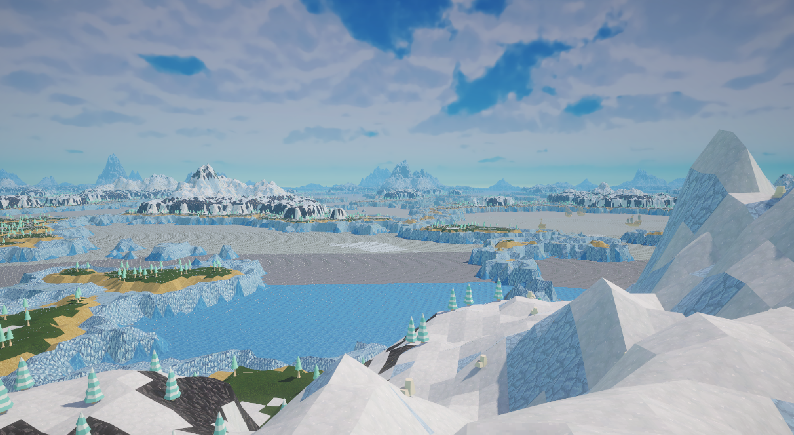

# Landscape Generator

This Unity project generates a stylized arctic environment. The landscape is generated through noise thats further modified through slope detection and animation curves, creating a mix of flat water, ice shelves, forests, and tall mountains.

## Features

- **Height-Based Terrain Generation**  
  Perlin noise is mapped through animation curves to shape different terrain zones—flat lakes, raised ice, gentle forested areas, and mountain peaks.

- **Texture Blending by Slope and Height**  
  Terrain textures (snow, rock, vegetation, etc.) are layered based on elevation and steepness, making transitions feel natural.

- **Chunked World Layout**  
  The world is divided into a 15×15 grid of 100×100 meter chunks—enough to fill the visible horizon from the center.

- **Procedural Prop Placement**  
  Boats, shipwrecks, trees, rocks, and other props are placed procedurally based on terrain features. Shipwrecks appear on ice shelves, forests grow in flatter mid-elevation zones, and snow-covered detail brings the mountains to life.

- **Atmospheric Effects**  
  Light blue fog and a bright skybox help sell the cold, distant feel of the environment.

## How It Works

- Custom **animation curves** drive elevation shaping  
- **Slope-based rules** control texture blending  
- A **16-texture UV map** is used across terrain, with ~8 active textures  
- **Props placed procedurally** based on terrain height and slope

## Assets Used

- **Textures**  
  [Dokucraft Dwarven](https://dokucraft.co.uk/resource-packs/dwarven)

- **3D Models**  
  [Kenney Survival Kit](https://www.kenney.nl/assets/survival-kit)  
  [Kenney Holiday Kit](https://www.kenney.nl/assets/holiday-kit)  
  [Kenney Pirate Kit](https://www.kenney.nl/assets/pirate-kit)

- **Skybox**  
  [Free Stylized Skybox](https://assetstore.unity.com/packages/2d/textures-materials/sky/free-stylized-skybox-212257)

## Future Plans

- Add collision to make the terrain interactive  
- Refactor terrain bands for faster iteration and better variety  
- Explore noise masking for more complex texture patterns  
- Keep tools flexible—procedural workflows only work if iteration stays fast

